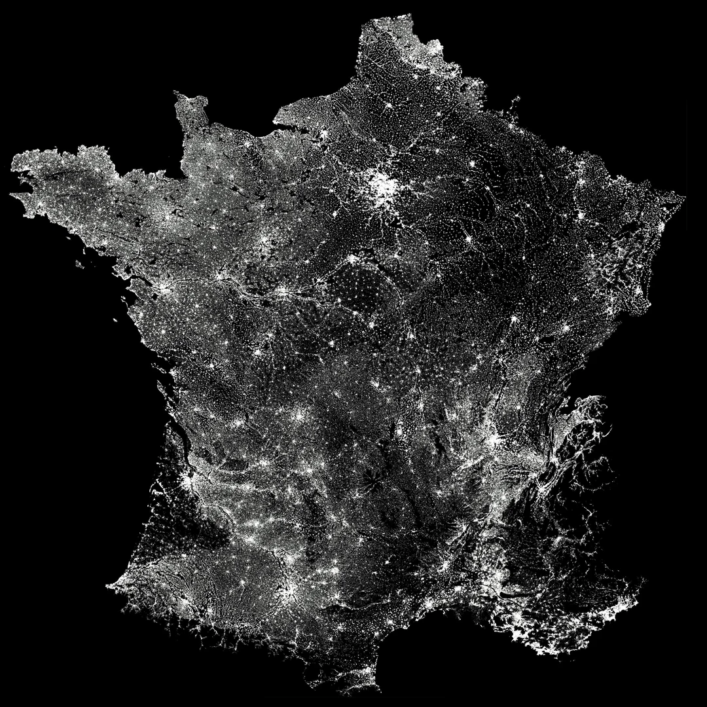
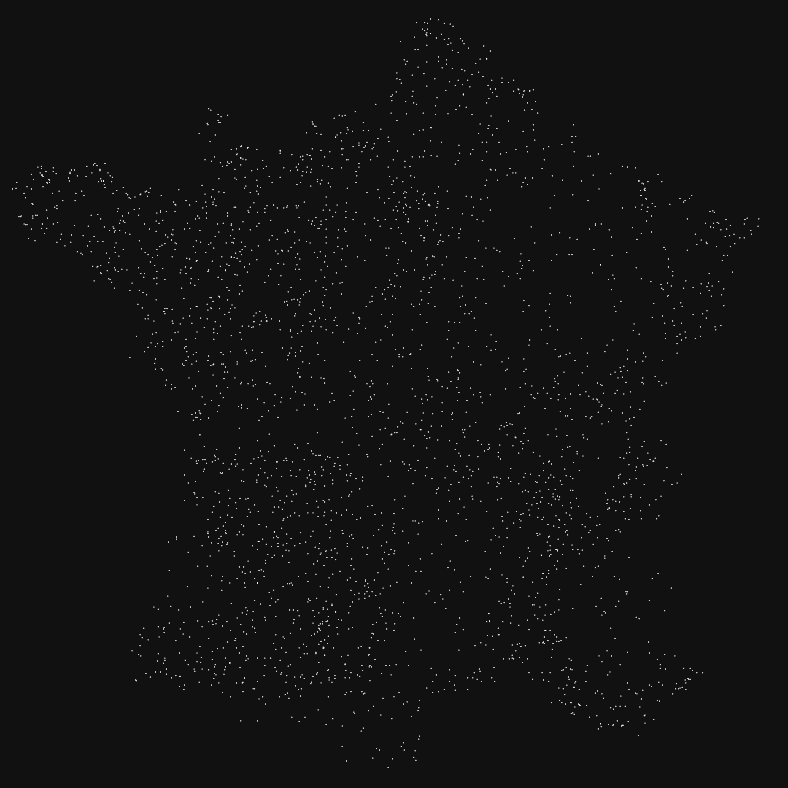
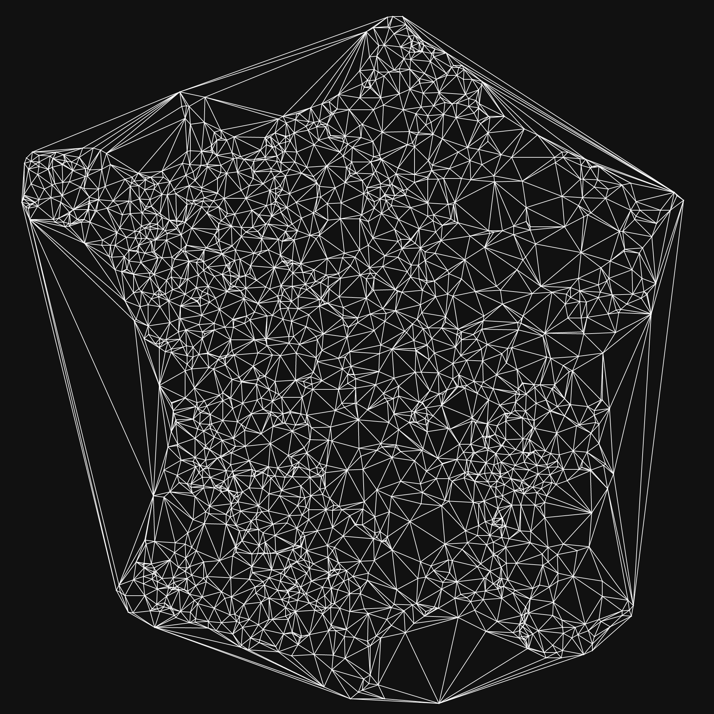

# Trianglib
Trianglib is a lightweight header-only library for Delaunay triangulation

## Density maps
The library can generate density of probabilities based on image files,
either greyscale or color depending on the pixels' intensity.

Points can be randomly-generated with said discrete probability distribution.

<table align="center" width="100%">
  <tr>
    <td align="center" width="50%">
      
    </td>
    <td align="center" width="50%">
      
    </td>
  </tr>
  <tr>
    <td align="center"><b>Input Greyscale Density Map</b></td>
    <td align="center"><b>3000 randomly generated points</b></td>
  </tr>
</table>
We can see the points are denser in the white areas, and less dense in the black areas

## 2D Delaunay Triangulation
A given 2D cloud of points can be triangulated using [Bowyer-Watson algorithm](https://en.wikipedia.org/wiki/Bowyer%E2%80%93Watson_algorithm):

<table align="center">
  <tr>
    <td align="center">
      
    </td>
  </tr>
  <tr>
    <td align="center"><b>2D Triangulation with 2000 randomly generated points</b></td>
  </tr>
</table>

# Usage
Any vector type works as input. \
To implement a vector type,
the template for the ```nth_impl.get```, ```set_nth_impl.set``` and ```get_scalar_type_impl.get```
methods need to be defined within th***e ```trianglib::util::vectors``` namespace.

The library implements the necessary methods for ```std::array<T, N>```:
```cpp
namespace trianglib::util::vectors
{
    template <std::size_t I, std::size_t N, typename scalarType>
    struct nth_impl<I, std::array<scalarType, N>> {
        static auto get(const std::array<scalarType, N>& arr) {
            return arr[I];
        }
    };

    template <std::size_t I, std::size_t N, typename scalarType>
    struct set_nth_impl<I, std::array<scalarType, N>> {
        static void set(std::array<scalarType, N>& arr, const scalarType x) {
            arr[I] = x;
        }
    };

    template<std::size_t N, typename scalarType>
    struct get_scalar_type_impl<std::array<scalarType, N>>
    { static scalarType get(); };
}
```

As such, a simple triangulation program can be defined by:
```cpp
using vec2 = std::array<double, 2>;
int main()
{
    const auto pentagon = std::vector<vec2>{{
        {0.500, 1.000},{0.976, 0.655},{0.794, 0.095},{0.206, 0.095},{0.024, 0.655},{0.500, 0.500}
    }};
    const auto mesh = trianglib::Triangulation2D::triangulate(pentagon);

    const std::filesystem::path rootDir = PROJECT_ROOT_DIR;
    const std::filesystem::path outputPath = rootDir / "output" / "pentagon.svg";
    auto svgFile = trianglib::SVGFile(outputPath.string());
    svgFile.writeMesh(mesh);
}
```

## Credits

---

This project makes use of the following third-party components:

* **[stb_image](https://github.com/nothings/stb)** (Sean Barrett and contributors) - Used for loading image files.
* **[Robust Geometric Predicates](https://www.cs.cmu.edu/~quake/robust.html)** (Jonathan Richard Shewchuk) - Used for the precise orientation and incircle tests required for the triangulation algorithm.
## License

---

Copyright (c) 2026 Jassoka

This project is licensed under the [MIT License](LICENSE) - see the `LICENSE` file for details.
